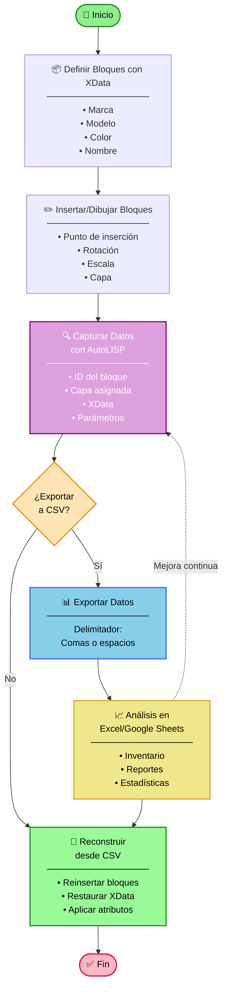

# Sala de Computación en AutoCAD — CSV ⇄ CAD (IMPCSV_ATTEXT)

**Autores:** Dixon Alberto Cuesta Segura · Carlos Fernando Quintero Castillo  
**Asistencia:** Carolina (ChatGPT)

> Proyecto para modelar la sala de computación (salón de clase) mediante bloques de AutoCAD con metadatos (XData) y un flujo de ida/vuelta con CSV. El comando AutoLISP `IMPCSV_ATTEXT` inserta bloques desde un archivo CSV, normaliza unidades y reasigna atributos; el exportador espejo está previsto en la hoja de ruta.

---

## 🚀 Resumen
Este repositorio demuestra un flujo **reproducible y auditable** entre datos tabulares y un plano CAD: cada elemento (mesa, pantalla, teclado, tablero, etc.) se define como **bloque** con XData estandarizada. Un script AutoLISP importa filas desde CSV y **reconstruye** el layout insertando bloques en su posición, capa, escala y rotación correctas, con atributos asignados.

- **Entrada:** CSV con columnas canónicas (ver formato).  
- **Proceso:** AutoLISP (`IMPCSV_ATTEXT`) normaliza números, interpreta rotación y asegura capas/atributos.  
- **Salida:** Dibujo con bloques insertados y parametrizados (listo para análisis, inventario y versionado).

Repositorio de referencia del curso/proyecto: <https://github.com/SrCoffeee/Computacion-Grafica-2025-2.git>

---

## 🧩 Características
- Inserción masiva de bloques **desde CSV** (con comillas y `;` como separador por defecto).
- **Normalización defensiva**: `X`, `Y`, `ROT`, `SX`, `SY` se dividen por 1000 (evita descalces de unidades).  
- **Rotación robusta**: si `|ROT/1000| ≤ 10` se asume radianes → conversión a grados; en otro caso se mantienen grados.
- **Atributos de bloque**: reasigna `NOMBRE`, `COLOR`, `MARCA`, `MODELO` si existen en el bloque.
- **Capa garantizada**: crea la capa si no existe y la aplica a la instancia insertada.
- **Ruta de bloques**: busca `<carpeta>/<name>.dwg` o permite seleccionarlo manualmente si falta.

---

## 📦 Estructura sugerida
```
.
├─ /bloques/                 # Carpeta con DWGs (MESA.dwg, PANTALLA.dwg, ...)
├─ /data/                    # CSV(s) de ejemplo
├─ IMPCSV_ATTEXT.lsp         # Comando de importación CSV → CAD
└─ README.md                 # Este documento
```

---

## 🧭 Diagrama de flujo


---

## ⚙️ Requisitos
- AutoCAD (con soporte **AutoLISP/ActiveX**).  
- Permisos para cargar LISP (`APPLOAD`).  
- Carpeta con los **DWGs** de bloques usados en el CSV.

---

## 🛠️ Instalación
1. Descarga `IMPCSV_ATTEXT.lsp` y colócalo en una carpeta accesible.
2. En AutoCAD, corre **APPLOAD** y carga el archivo; o desde la consola:  
   ```lisp
   (load "IMPCSV_ATTEXT.lsp")
   ```
3. Asegura que la carpeta `/bloques/` contiene los DWGs requeridos.

---

## ▶️ Uso
1. Ejecuta el comando: **`IMPCSV_ATTEXT`**.  
2. Selecciona **un DWG** dentro de la carpeta de bloques (para que el script detecte la ruta base).  
3. Selecciona el **CSV** a importar.  
4. El script insertará cada bloque en `(X/1000, Y/1000, 0)`; aplicará `ROT` (grados o rad→deg según umbral) y `SX/SY` normalizados (con fallback a `1.0` si resultan `0`).  
5. Se ejecuta `ZOOM E` al finalizar para ver el layout completo.

---

## 🧾 Formato del CSV
- **Separador esperado:** `;` (punto y coma).  
- **Encabezado:** la primera línea se ignora (puedes dejar nombres de columnas).  
- **Orden mínimo (≥ 11 columnas):**
  1. `name` (nombre del bloque)
  2. `layer`
  3. `NOMBRE`
  4. `COLOR`
  5. `MARCA`
  6. `MODELO`
  7. `X`
  8. `Y`
  9. `ROT`
  10. `SX`
  11. `SY`

**Ejemplo:**
```csv
name;layer;NOMBRE;COLOR;MARCA;MODELO;X;Y;ROT;SX;SY
MESA;MOBILIARIO;Mesa A1;Roble;ACME;M-120;4200;13500;0;1000;1000
PANTALLA;DISPOSITIVOS;Pantalla 1;Negro;Viewmax;VM24;4300;13550;1570;1000;1000
TECLADO;DISPOSITIVOS;Teclado 1;Negro;Zeta;ZK100;4350;13550;0;1000;1000
```
> **Nota:** El script **divide entre 1000** a `X`, `Y`, `ROT`, `SX`, `SY`. Ajusta los datos de entrada a tu convención (p. ej., si tu plano trabaja en metros y tu CSV en milímetros).

---

## 🔍 Detalles técnicos
- `_csv-split-single` respeta comillas simples/dobles.  
- `_parse-num` / `_parse-scale`: convierten `,` → `.` y normalizan ÷1000; las escalas `0` se corrigen a `1.0`.  
- `_rot-to-deg`: si `|v| ≤ 10` se interpreta como radianes; en otro caso se usa tal cual (grados).  
- `_ensure-layer`: crea la capa si no existe.  
- `_insert-block`: inserta desde el dibujo o desde la carpeta `<ruta>/<name>.dwg`; si no existe, se permite seleccionar manualmente o saltar.

---

## 🗺️ Hoja de ruta
- **Exportador espejo** `EXPCSV_ATTEXT` (CAD → CSV) con el mismo esquema de columnas.  
- **Validador previo** (columnas, tipos, existencia de DWGs, UCS→WCS) con reporte `.log`.  
- **Separador parametrizable** (`,` / `;` / espacio) y soporte opcional **JSON**/**Parquet**.  
- **UI con DCL**: vista previa del CSV y resolución interactiva de faltantes.  
- **Pipelines analíticos** (notebooks de Python, BI) para tableros de ocupación, obsolescencia y mantenimiento.

---

## 🤝 Contribuir
1. Crea un fork y una rama descriptiva (`feat/exportador`, `fix/rotacion`, etc.).  
2. Asegura ejemplos en `/data/` y una nota en este README.  
3. Abre un **Pull Request** con contexto y capturas cuando aplique.

---

## 🧑‍💻 Autores
- **Dixon Alberto Cuesta Segura** — modelado y especificación funcional.  
- **Carlos Fernando Quintero Castillo** — desarrollo AutoLISP y documentación.  

---

## 📄 Licencia
Licencia abierta a definir por los autores. Sugerido: **MIT**. (Añadir archivo `LICENSE`).


